# RTL to GDSII Implementation of a 16-bit Up/Down Counter using OpenLane (Sky130)
---
# Table of Contents

- [Introduction](#introduction)
- [OpenLane](#openlane)
- [OpenLane Execution](#openlane-execution)
- [RTL-to-GDS](#rtl-to-gds-flow)
   - [Design Specification](#design-specification)
   - [Environment Setup and Design Preparation](#environment-setup-and-design-preparation)
   - [Physical Design](#physical-design)
     - [Synthesis](#synthesis)
     - [Floorplanning](#floorplanning)
     - [Placement](#placement)
     - [Clock Tree Synthesis](#clock-tree-synthesis)
     - [Timing Optimization](#timing-optimization)
     - [Routing](#routing)
  - [Layout Generation and Visualization](#layout-generation-and-visualization)
  - [Signoff](#signoff)
- [Conclusion](#conclusion)

---

# Introduction
This repository presents a complete RTL-to-GDSII implementation of a simple 16-bit up/down counter using the OpenLane open-source ASIC flow and the Sky130 PDK.
The design is developed in Verilog and taken through the full digital implementation flow using open-source EDA tools such as Yosys, OpenROAD, Magic, and KLayout.
It captures the practical execution of industry-style ASIC steps including synthesis, floorplanning, placement, clock tree synthesis, routing, layout verification, 
and final GDSII generation using a fully open-source toolchain.  

--- 
# OpenLane
OpenLane is an open-source, fully automated RTL-to-GDSII digital ASIC flow built around a collection of industry-relevant EDA tools. It integrates tools such as Yosys for logic synthesis, OpenROAD for floorplanning, placement, clock tree synthesis, and routing, and Magic and KLayout for layout visualization and physical verification.

OpenLane enables the complete implementation of standard-cell based digital designs using open-source PDKs such as Sky130, providing a practical and accessible platform for understanding real-world ASIC design flows.

---
# OpenLane Execution

The following screenshots capture the OpenLane flow as it runs
in interactive mode. They show the sequence of commands being
executed during the setup and initialization of the design
workspace before proceeding to step-by-step implementation.  

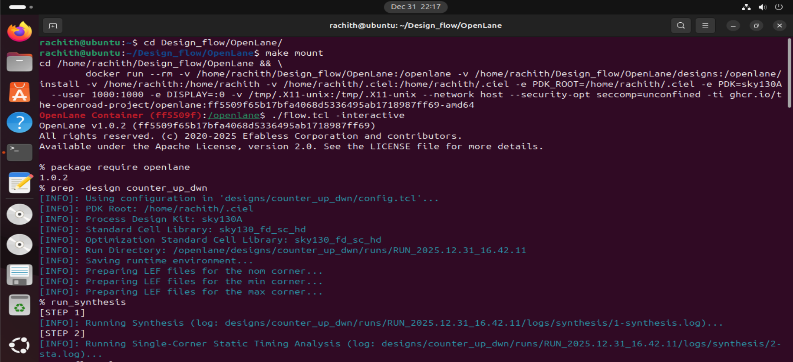  
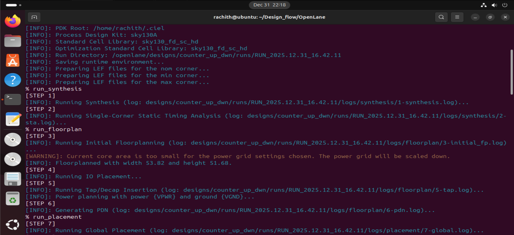 
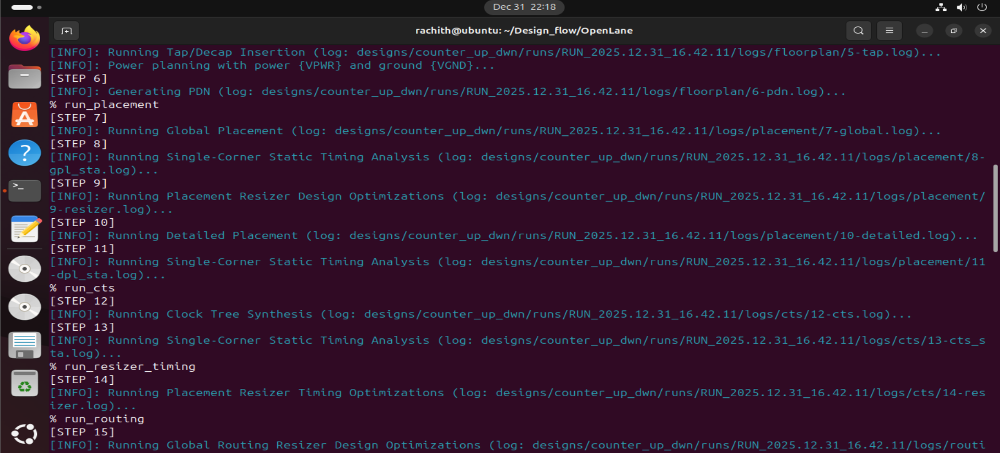 
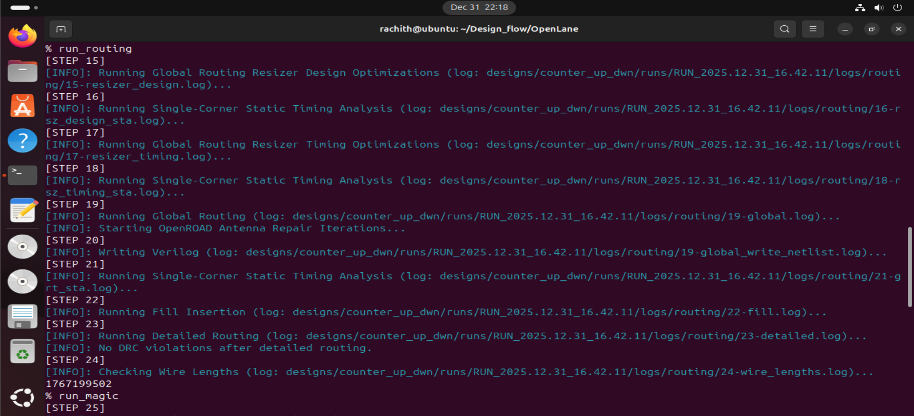 
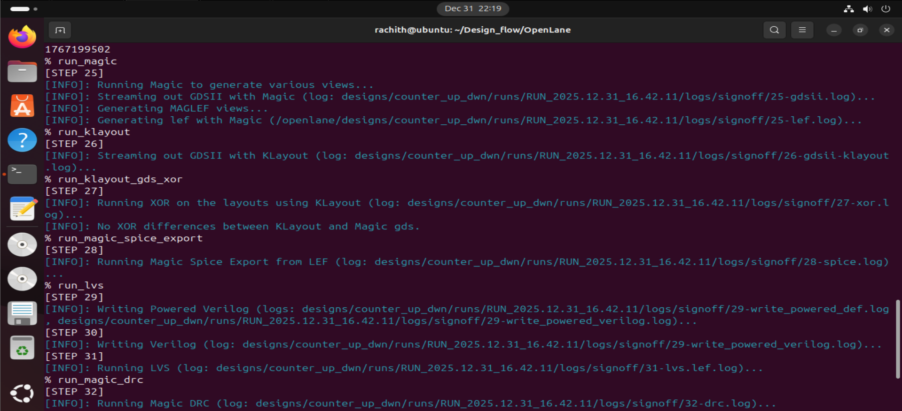 
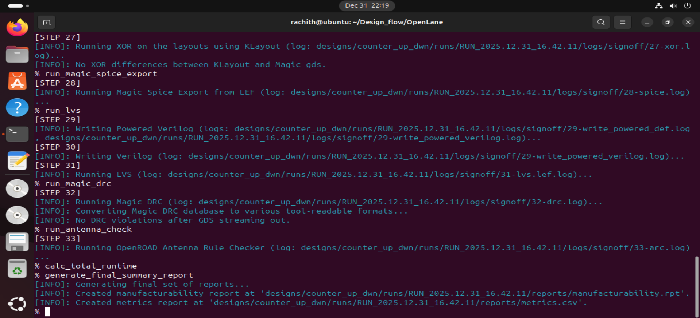  

--- 
# RTL to GDS Flow

This section presents the step-by-step implementation of the 16-bit up/down counter using the OpenLane open-source flow.
It covers environment setup, RTL-to-GDS execution, post-layout verification and final report generation.  

---
## 1. Design Specification

This is a **16-bit synchronous up/down counter** with enable and reset signals.  
The counter increments or decrements on each rising edge of `clk` based on the `ctrl` input when `en` is high.

| Signal | Direction | Description |
|--------|----------|-------------|
| `clk`  | input    | System clock signal |
| `rst`  | input    | Active-high synchronous reset, clears counter to 0 |
| `en`   | input    | Enable signal; counting occurs only when high |
| `ctrl` | input    | Control signal; `0` → count up, `1` → count down |
| `count`| output   | 16-bit counter output |

 - The output Waveform obtained after simulating the [Counter.v](Verilog%20Files/counter_up_dwn.v) with a testbench [Counter_tb.v](Verilog%20Files/counter_up_dwn_tb.v) confirms correct operation of design. 

 
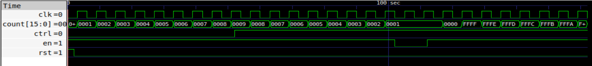   


 - Generic Schematic of the design obtained through Yosys before mapping with SKY130 is as follows:

 
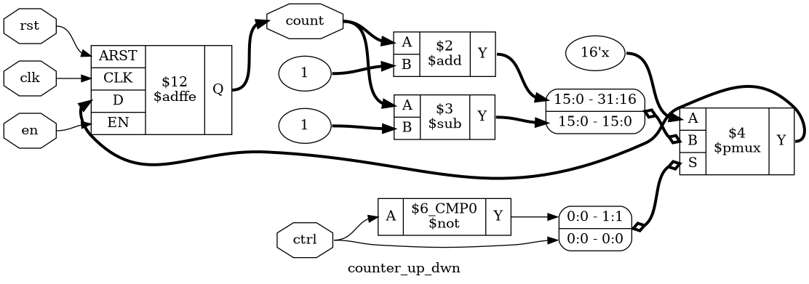  

---
## 2. Environment setup and Design preparation  

This step prepares the OpenLane environment and design workspace,
ensuring that all necessary packages are loaded and the design
is ready for the RTL-to-GDS implementation flow.

| Command | Description |
|---------|-------------|
| `make mount` | Mounts the OpenLane environment, setting up necessary paths and dependencies. |
| `./flow.tcl -interactive` | Launches OpenLane in interactive mode for step-by-step execution of the design flow. |
| `package require openlane` | Loads the OpenLane package into the TCL environment, making flow commands available. |
| `prep -design counter_up_dwn` | Prepares the design workspace by loading the configuration and initializing the 16-bit up/down counter design. |  

---
## 3. Physical Design  
This section presents the **step by step implementation of the 16-bit up/down counter**, covering all key commands from Synthesis to Routing.

---
### 3.1 Synthesis

In this step, the RTL code is translated into a **gate-level netlist** using the standard cells from the Sky130 PDK.  
The synthesis process optimizes the design for **area, timing, and power**, preparing it for the subsequent physical design steps.

| Command | Description |
|---------|-------------|
| `run_synthesis` | Performs RTL synthesis using OpenLane’s integrated Yosys tool. It maps the Verilog design to Sky130 standard cells, generates the gate-level netlist, and produces reports for timing and area analysis. |  

 - The Gate Level Schematic of the design obtained through Yosys after synthesis with SKY130 is as follows:

 


---
### 3.2 Floorplanning

Floorplanning defines the **physical layout of the design** on the chip.  
It sets the **core area**, **I/O placement**, and guides the placement and routing tools to optimize area and timing.  
This step is critical for achieving a balanced design with good utilization and minimal congestion.

| Command | Description |
|---------|-------------|
| `run_floorplan` | Performs floorplanning using OpenLane. It allocates core and pad areas, positions I/Os, and generates initial placement guidelines for standard cells. |


The images below, captured from **Magic**, show the layout after floorplanning:

 
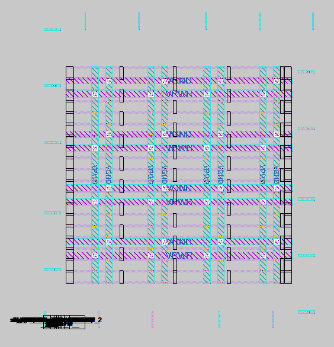   

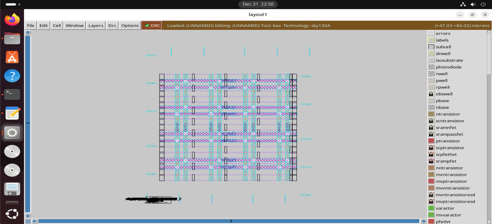 


---  
### 3.4 Placement

Placement determines the **exact positions of all standard cells** within the core area defined during floorplanning.  
A good placement ensures **minimal wire length, reduced congestion, and better timing**, which is essential for an efficient and manufacturable design.

| Command | Description |
|---------|-------------|
| `run_placement` | Performs standard cell placement using OpenLane. It positions all gates in the design according to the floorplan, optimizes cell locations to reduce timing violations, and prepares the design for clock tree synthesis and routing. |

The images below, captured from **Magic**, show the placement of standard cells within the core area:

 
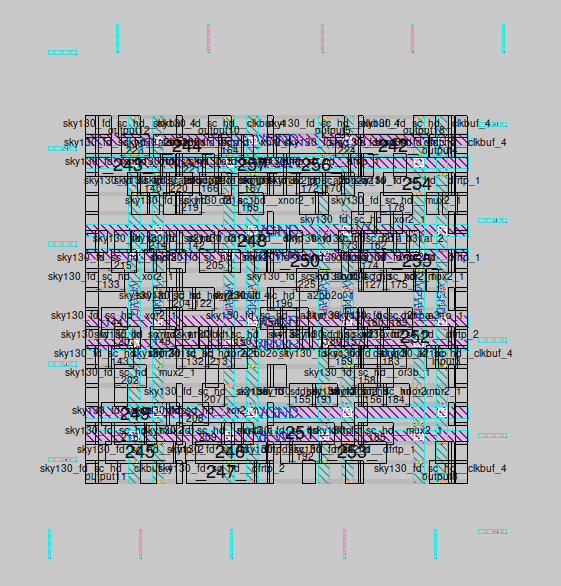   

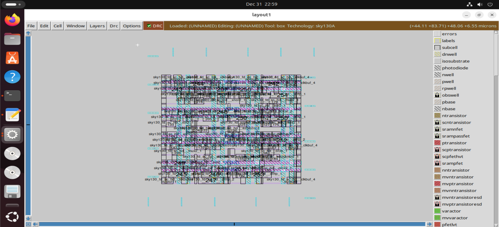   


---
### 3.5 Clock Tree Synthesis 

Clock Tree Synthesis (CTS) ensures that the **clock signal reaches all sequential elements** (flip-flops) with minimal **skew and latency**.  
A balanced clock tree is critical for correct timing and synchronization across the entire chip.

| Command | Description |
|---------|-------------|
| `run_cts` | Builds and balances the clock distribution network using OpenLane. It inserts buffers and routes clock nets to minimize skew, ensuring all flip-flops receive the clock signal reliably. |


The images below, captured from **Magic**, includes the clock tree:

 
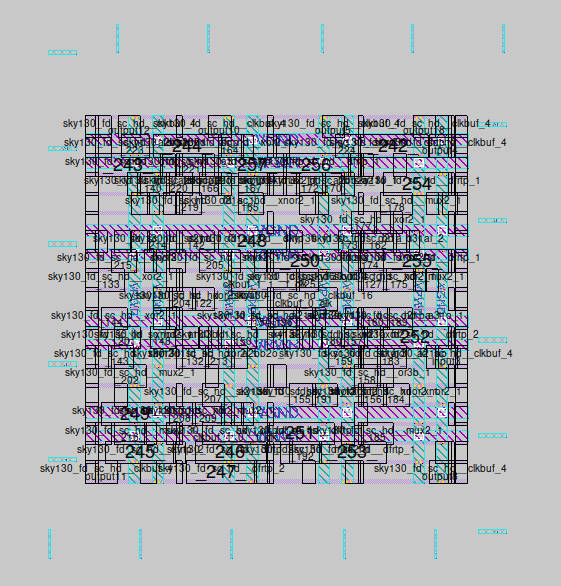   

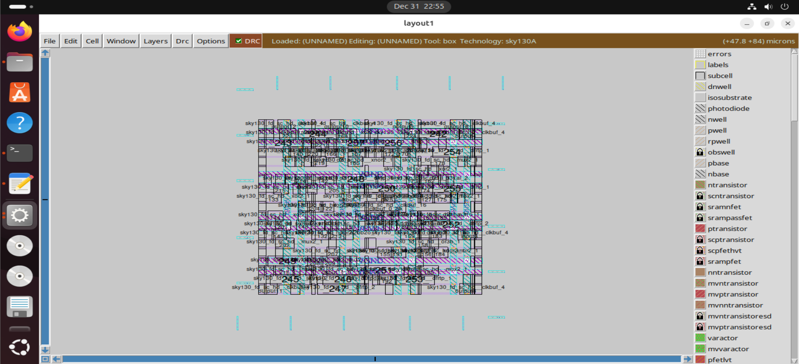 


---
### 3.6 Timing Optimization

After placement and clock tree synthesis, the design may have **timing violations** (setup or hold).  
Timing optimization adjusts the design to **meet timing constraints**, ensuring reliable operation at the target clock frequency.

| Command | Description |
|---------|-------------|
| `run_resizer_timing` | Automatically upsizes or downsizes gates, adjusts buffers, and makes timing-driven modifications to fix setup and hold violations. This step ensures the design meets timing requirements before routing. |  

**Timing Report (after CTS):**
```text
===========================================================================
report_tns
============================================================================
tns 0.00

===========================================================================
report_wns
============================================================================
wns 0.00

===========================================================================
report_worst_slack -max (Setup)
============================================================================
worst slack 5.52

===========================================================================
report_worst_slack -min (Hold)
============================================================================
worst slack 0.24

```

---
### 3.7 Routing 

Routing connects all standard cells and macros according to the netlist and placement, creating **physical connections (metal layers) between gates**.  
A well-optimized routing ensures **minimal congestion, correct signal connectivity, and meets timing requirements**.

| Command | Description |
|---------|-------------|
| `run_routing` | Performs global and detailed routing using OpenLane. It generates metal interconnects between all placed cells, resolves congestion, and ensures signal integrity for the design. |

The images below, captured from **Magic**, show the routed design:

 
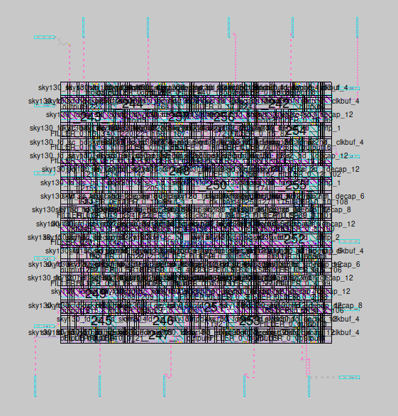   

  


---
## 4. Layout Generation and Visualization

After physical design, the layout can be **visualized** before post-layout verification.  
OpenLane integrates tools like **Magic** and **KLayout** to view the design at the GDSII level and compare layouts.

| Command | Description |
|---------|-------------|
| `run_magic` | Opens the design in **Magic**, allowing visualization of the layout at the transistor/cell level, checking routing, placement, and layers. |
| `run_klayout` | Opens the design in **KLayout**, another layout viewer, for a detailed view of the GDS layout. |

**Visualization in Klayout:**  

 

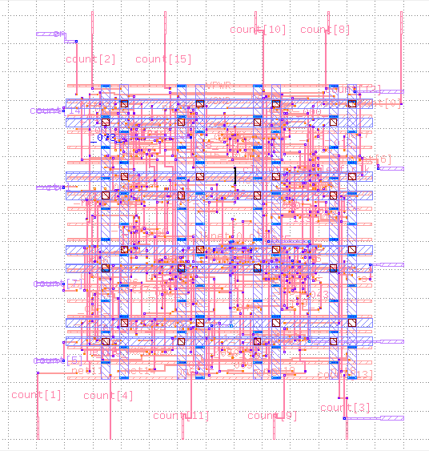   

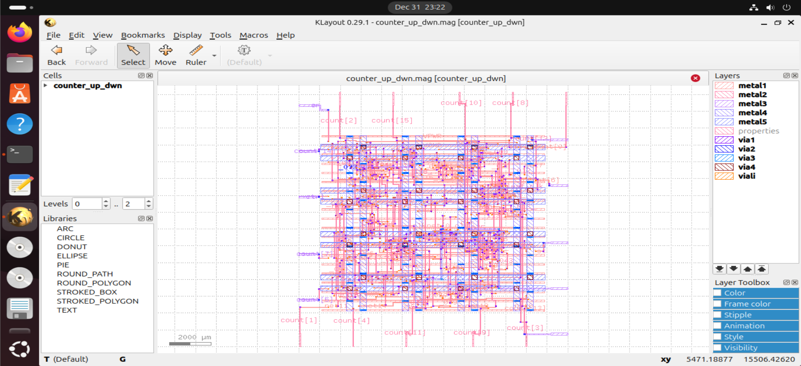 

 

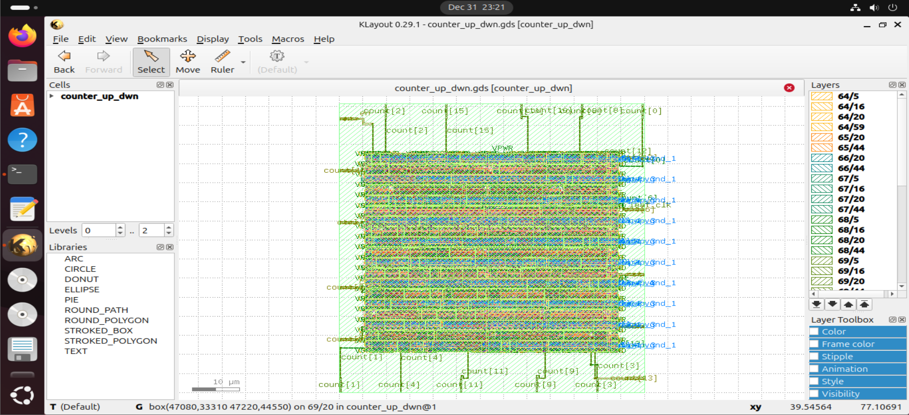  


  

**Visualization in Magic:**  

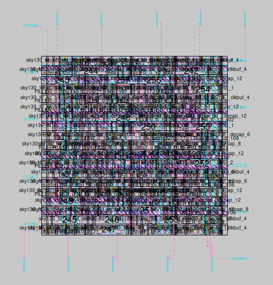   

   

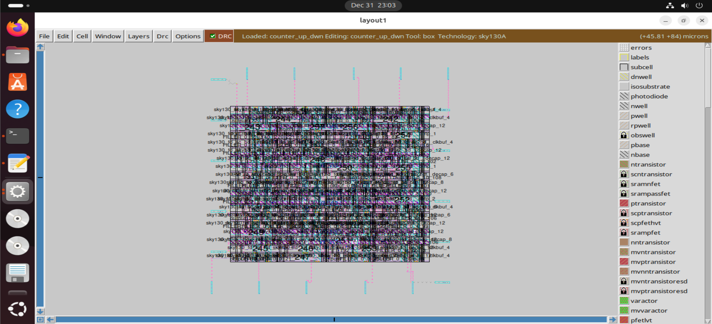   


---
## 5. Signoff

After layout generation, the design undergoes **post-layout verification** to ensure that the physical implementation matches the RTL and meets manufacturing rules.  
These checks are critical for **functional correctness, design rule compliance, and manufacturability**.

| Command | Description |
|---------|-------------|
| `run_klayout_gds_xor` | Performs a **GDS XOR comparison** between the layout generated by OpenLane and a reference GDS, highlighting differences for verification. |
| `run_magic_spice_export` | Exports the layout to a **SPICE netlist**, which can be used for post-layout simulations to verify electrical behavior. |
| `run_lvs` | Performs **Layout vs. Schematic (LVS) verification**, checking that the layout matches the original RTL/gate-level netlist. |
| `run_magic_drc` | Runs **Design Rule Check (DRC)** to ensure that the layout follows all PDK-specific geometric and spacing rules required for fabrication. |
| `run_antenna_check` | Performs **antenna checks** to detect potential charge accumulation issues that could damage gates during manufacturing. |


  
These steps ensure that the design is **functionally correct, layout-compliant, and ready for fabrication**.  
The following snippets highlight the final signoff status obtained from OpenLane reports and logs.  

```text
Total XOR differences = 0
```

```text
LVS reports no net, device, pin, or property mismatches.
Total errors = 0
```

```text
Design Name: counter_up_dwn
Run Directory: /openlane/designs/counter_up_dwn/runs/RUN_2025.12.31_16.42.11
----------------------------------------

Magic DRC Summary:
Source: /openlane/designs/counter_up_dwn/runs/RUN_2025.12.31_16.42.11/reports/signoff/drc.rpt
Total Magic DRC violations is 0
----------------------------------------

LVS Summary:
Source: /openlane/designs/counter_up_dwn/runs/RUN_2025.12.31_16.42.11/logs/signoff/31-counter_up_dwn.lef.lvs.log
Number of nets: 171                        |Number of nets: 171                        
Design is LVS clean.
----------------------------------------

Antenna Summary:
Source: /openlane/designs/counter_up_dwn/runs/RUN_2025.12.31_16.42.11/logs/signoff/33-arc.log
Pin violations: 0
Net violations: 0

```

---
## 6. Final Reports

After completing all physical design and signoff checks, OpenLane generates **final summary reports** that provide an overview of the design’s implementation metrics and execution details. These reports help in understanding the **overall quality, correctness, and efficiency** of the RTL-to-GDS flow.

| Command | Description |
|---------|-------------|
| `calc_total_runtime` | Calculates the total runtime of the complete OpenLane flow, giving insight into tool execution time and flow efficiency. |
| `generate_final_summary_report` | Generates a consolidated report summarizing key metrics such as area, timing, utilization, and signoff status. |

**Report Summary:**

The final reports indicate that the design completed the RTL-to-GDS flow successfully, with all critical checks passing and no major violations reported. These reports mark the completion of the design implementation process.

| Category               | Metric                     | Value             |
| ---------------------- | -------------------------- | ----------------- |
| **Design**             | Design Name                | `counter_up_dwn`  |
|                        | Standard Cell Library      | `sky130_fd_sc_hd` |
|                        | Synthesized Cell Count     | **137 cells**     |
|                        | Flow Status                | **Completed**     |
| **Runtime**            | Total Runtime              | **4 min 45 sec**  |
|                        | Routing Runtime            | 2 min 51 sec      |
| **Area & Utilization** | Die Area                   | **0.00492 mm²**   |
|                        | Core Area                  | **2781.42 µm²**   |
|                        | Final Core Utilization     | **56.31 %**       |
| **Timing**             | Worst Negative Slack (WNS) | **0.0 ns**        |
|                        | Total Negative Slack (TNS) | **0.0 ns**        |
|                        | Critical Path Delay        | **11.0 ns**       |
|                        | Suggested Clock Frequency  | **~90.9 MHz**     |
| **DRC**                | Magic DRC Violations       | **0**             |
| **LVS**                | Total LVS Errors           | **0**             |
| **Antenna**            | Pin Antenna Violations     | **0**             |
|                        | Net Antenna Violations     | **0**             |
| **Routing Quality**    | Short Violations           | 0                 |
|                        | Metal Spacing Violations   | 0                 |
|                        | Off-Grid Violations        | 0                 |
| **GDS Check**          | KLayout GDS XOR Violations | **0**             |

Detailed implementation metrics are available in the [metrics.csv](Reports/metrics.csv) file. 

---
# Conclusion

Final GDS file: [gds](Results/signoff/counter_up_dwn.gds) 

This project demonstrates a complete RTL-to-GDS implementation of a 16-bit up/down counter using the open-source OpenLane flow and Sky130 PDK. The design successfully progressed through synthesis, physical design, layout generation, and signoff, achieving clean DRC, LVS, antenna, and timing results. Overall, this work provided practical exposure to an end-to-end ASIC digital implementation workflow using open-source EDA tools.


